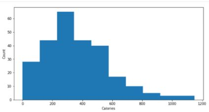
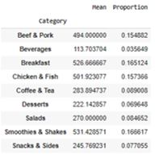
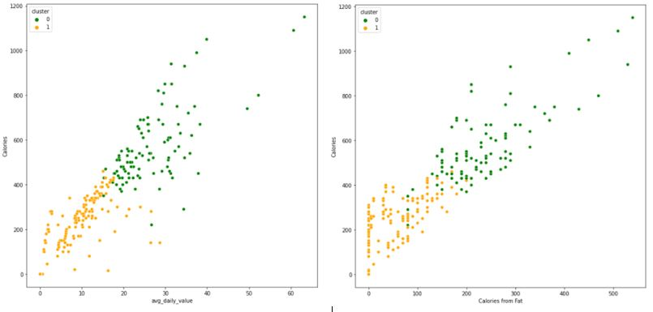
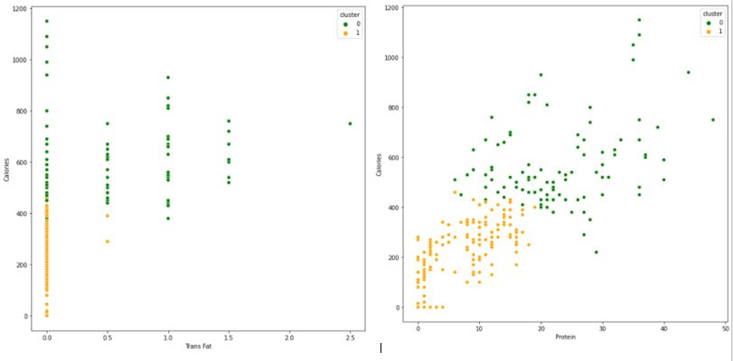
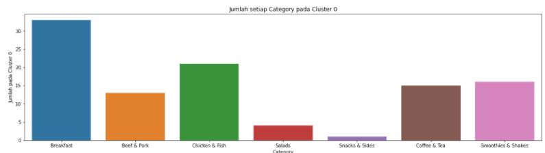
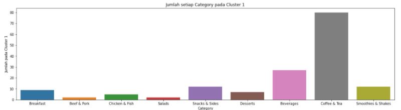
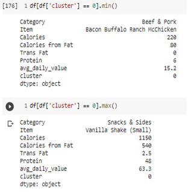
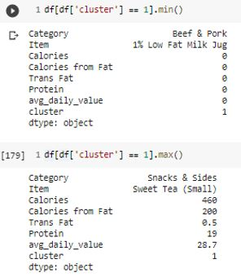
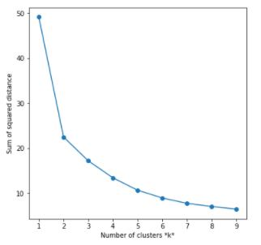

# Nutrition-Fact-for-McDonald's-Menu-Clustering

## Business Background
Fast Food is known for unhealthy food. The stigma that is formed in society is fast food does not contain nutrients. Because of this stigma, fast food customers began to decrease. one of the company that affected is McDonald's. The impact is McDonald's customer reduction. Therefore, McDonald's makes service improvements by paying attention to the nutritional level of customers in order to keep consuming fast food safely and to increase sales activity again. The thing that can be done is to do a combination of the McDonald's menu where the combination has a number of calories that is not excessive so it is safe for consumption by customers. The combination will be in the form of a food package, which has a Main menu, drink and additional menu.

## Problem
Reduced McDonalds customers due to the unhealthy stigma of fast food, which can cause a decrease in buying and selling activities and company profits.

## Business Question
- How is the combination of McDonald's menu that can meet the customer's daily nutritional needs?
The analytical approach taken is clustering, which is make the cluster of McDonald's menu into several groups which will be compared specifically for the characteristics of each group.

## Goals
Retain customers that consuming fast food but still pay attention to nutritional needs so it's safe for consumption. It also aims to increase sales activity so that the company does not experience losses continuously.

## About Data
- Column definitions
  - Category: Identifies McDonald's menu category. In this column the items are divided into nine categories, namely breakfast, beef & pork, chicken & fish, salads, snacks & sides, desserts, beverages, coffee & tea, and smoothies & shakes. This column is of type data object.
  - Item: Menu items from various categories. Each category has different items. The breakfast category consists of 42 items, 15 items for beef & pork category, 27 items for chicken & fish category, 6 items for salads category, 13 items for snacks & sides category, 7 items for desserts category, 27 items for beverages category, 95 items for coffee & tea category, and for smoothies & shakes category. 28 items. This column is of type data object.
  - Serving Size: Identifies the number of servings per item in oz and grams. The data type of this column is object.
  - Calories: Total calories contained in one meal serving. Calories are units of energy or the amount of energy in the food consumed. Calories are based on food sources be they carbohydrates, fats or proteins.
  - Calories from Fat: Number of calories from fat in one serving.
  - Total Fat: Total fat content in one serving.
  - Total fat (% daily value): Percentage of total fat content in one serving of energy needs per day (2000 calories).
  - Saturated fat: Saturated fat content in grams contained in one serving.
  - Saturated Fat (% daily value): Percentage of saturated fat content to energy needs per day (2000 calories) in one serving.
  - Trans Fat: Total unsaturated fat content in one serving.
  - Cholesterol: Total cholesterol in one serving.
  - Cholesterol (% daily value): Percentage of cholesterol content to energy needs per day (2000 calories).
  - Sodium: Amount of natural salt content and added salt in units of grams. Every day sodium should not be consumed more than 2300-2400 mg / day.
  - Sodium (% daily value): Percentage of sodium content in grams of energy needs per day (2000 calories).
  - Carbohydrates: Amount of carbohydrates in one serving.
  - Carbohydrates (% daily value): Percentage of carbohydrate content to daily energy needs (2000 calories) in one serving.
  - Dietary Fiber: Total fiber in one serving. The recommended daily intake of fiber is 25-30 grams.
  - Dietary Fiber (% daily value): Percentage of fiber content against daily energy needs (2000 calories) in one serving.
  - Sugars: How many carbohydrates consisting of pure glucose in units of grams. Pure glucose can increase blood glucose levels.
  - Protein: Protein content, both animal and vegetable protein, in one serving.
  - Vitamin A (% daily value): Percentage of vitamin A content in energy needs per day (2000 calories).
  - Vitamin C (% daily value): Percentage of vitamin C content in energy needs per day (2000 calories).
  - Calcium (% daily value): Percentage of calcium content in energy needs per day (2000 calories).
  - Iron (% daily value): Percentage of iron content in energy needs per day (2000 calories).

This image shows data distribution of the calories. The graph shows that the calories content on the McDonald's menu tends to be higher at 100 - 550 calories

It can be seen in the table that Smoothies & Shakes has the highest average calories

## Modelling
  - Use one of unsupervised learning, Kmeans, where this algorithm is partitioning clustering that divides clusters of data that have the same characteristics. The concept is to form clusters where similar samples enter the same cluster and different samples enter into other clusters.
  - Result :
  

  
From the scatter plot above, it can be seen that cluster 0 has the characteristics of avg_daily_value, calories of fat, Trans Fat and Protein which tend to be high while cluster 1 tend to be low calories
  

  
Cluster 0 tends to be in breakfast category.
  

Cluster 1 tends to be in Coffe and Tea category.

  
  Cluster 0: has 220 - 1150 calories, Calories from Fat 80 - 540 calories, Trans Fat 0 - 2.5 grams, Protein 6 - 4.8 grams and avg_daily_value 15.2 - 63.3%. (High Calories)
  
  Cluster 1: has 0 - 460 calories, Calories from Fat 0 - 200 calories, Trans Fat 0 - 0.5 grams, Protein 0-19 grams and avg_daily_value 0 - 28.7%. (Low Calories)
  
  Based on this clusters, The food can be combined for packages that will be offered. For example, when food comes from cluster 0 it can be packaged with drinks from cluster 1 and vice versa. For example the Breakfast package with Sausage McMuffin (cluster 0) and Caramel Latte (Small) (cluster 1) or the Lunch Package with Double Cheeseburger (cluster 1) and Coca Cola Classic (Small) (cluster 0).
  
## Evaluation

Evaluation is carried out to determine the best cluster k. When the line chart forms an "Elbow", then the k value is the best k value. "Elbow" can go up or down, but if there is a sharp drop, this is the best k value.
